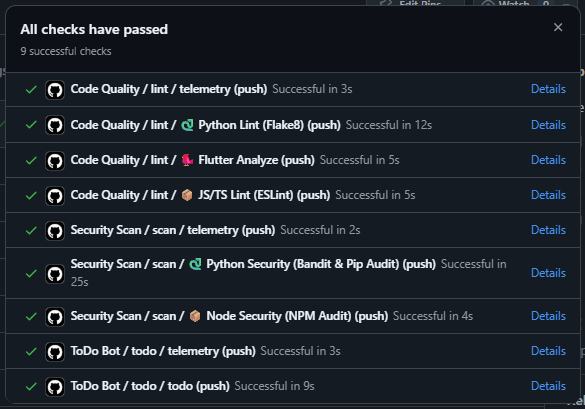
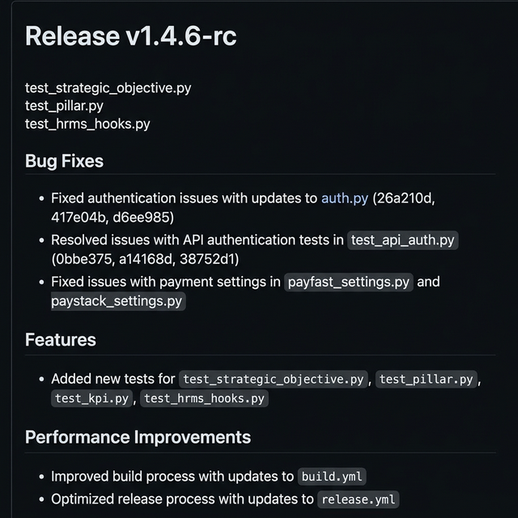
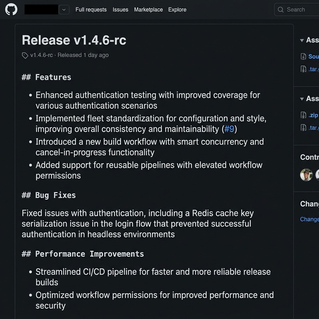

# Universal Shared Workflows

<!-- usage-badge-start -->


<!-- usage-badge-end -->

A library of reusable GitHub Actions for "Universal" CI/CD.
Designed for **pnpm** (preferred), **Flutter**, **Node.js**, **Frappe**, and **Documentation** projects.



## Features

*   **🛡️ CI-Gate Orchestration**: The new `universal-pipeline.yml` chains `Security` -> `Lint` -> `CI` -> `Release` sequentially. Tags are only created if all quality checks pass.
*   **🧠 Smart Detection**: The `build.yml` workflow automatically scans your repo for `pubspec.yaml` (Flutter), `package.json` (Node.js), or Frappe patterns and runs the correct pipeline via the orchestrator.
*   **📦 Universal Release**: One workflow (`release.yml`) handles Semantic Versioning, AI Release Notes, and Git Tagging for ALL project types, protected by the CI-Gate.
*   **📱 Multi-Platform**: Supports Android (APK/Bundle), iOS (IPA), macOS (.app), Windows (Zip), and Web.
*   **🧹 Maintenance Bots**: Auto-merge Dependabot, Stale issue closer, PR Assignee, Labeler, and more.
*   **⚡ Dynamic Source Rename**: Transparently rebrands Android source paths (e.g., `com.example` -> `com.juvo.runner`) on the fly for client builds, based on an explicit `app-type` input.
*   **🤫 Silent Transformation**: Perfroms all renames and package updates without exposing original vendor names in the CI logs.
*   **🧠 AI Release Notes**: Diff-aware release notes using Brain API or Groq AI (`groq/compound` → `llama-3.3-70b`), reading actual code changes to produce professional feature summaries — not file name lists.
*   **⏳ Historical Backfill**: Ability to retrospectively regenerate AI release notes for all past stable releases via a single workflow input (`backfill_ai_notes_cutoff_version`).
*   **🔍 Continuous Verification**: Automatically boot a headless Android emulator, install the app, and capture a "Deterministic UI" screenshot and runtime logs on every push.

---

## 🔍 Continuous Verification (Flutter)

The CI system now supports automated runtime verification to eliminate manual APK testing during development.

### 1. How it works
On every push (if `run_verify` is enabled), the CI will:
- Boot a headless Android emulator.
- Install the **Debug** APK.
- Launch the app using the `monkey` tool for maximum compatibility.
- Wait for the UI to stabilize (using a retry loop) and capture a screenshot (`verification.png`).
- Capture `logcat` logs (`logs.txt`) including API activity.
- Upload results as a `verification-results` artifact.

### 2. Implementation in Flutter
To benefit from this, your app should support a deterministic verification mode that bypasses login and loading states.

**Example (Flutter/Dart):**
```dart
const isVerifyMode = bool.fromEnvironment('VERIFY_MODE', defaultValue: false);

if (isVerifyMode) {
  // 1. Bypass Login / Intro
  // 2. Mock API data or use stable test accounts
  // 3. Navigate directly to the screen you want verified
}
```

> [!TIP]
> Since the CI launches the app via the `monkey` tool, it is recommended to bake the `VERIFY_MODE` flag into the debug build itself (e.g., using `--dart-define=VERIFY_MODE=true` during the build step if desired, though the default is to capture the initial app state).

---

## 🚀 How to Use (The "Drop-in" Standard)

All repositories in the fleet should typically have the standard set of workflows.

### 1. Simple Bootstrap (Recommended)

Run our interactive one-liner from the root of your repository. It will bootstrap your repo with the standard fleet workflows and a `version.json`. 

> [!NOTE]
> It will ask if you want to **Standardize** (Full Defaults) or **Customize** (Specific Project Type, Versions, etc.).

**Windows (PowerShell):**
```powershell
iwr -useb https://raw.githubusercontent.com/RokctAI/shared-workflows/main/install.ps1 | iex
```

**Unix / macOS / Linux (Bash):**
```bash
curl -sSL https://raw.githubusercontent.com/RokctAI/shared-workflows/main/install.sh | bash
```

### 2. Manual Copy (Local Development)
If you have `shared-workflows` cloned locally as a sibling to your current project, you can copy the files directly:

```bash
# Assumes your folders are: 
# /Work/shared-workflows/
# /Work/your-project/ <--- Run from here
cp -r ../shared-workflows/examples/workflows .github/workflows
```

### 3. What you get
This installs **"The Unified Fleet"**:

| Workflow | Purpose | Orcherstration ⛓️ |
| :--- | :--- | :--- |
| **`build.yml`** | **Manual/Push CI** | Uses `universal-pipeline.yml`. Auto-detects **Flutter**, **Node**, or **Frappe**. |
| **`release.yml`** | **Auto Release** | Uses `universal-pipeline.yml`. Locked to **Friday 11 PM UTC**. |
| **`linter.yml`** | **Code Quality** | Runs Flake8, Flutter Analyze, or ESLint based on file patterns. |
| **`security.yml`**| **Vulnerability Fix**| Automated security scanning and patching. |
| **`...others`** | **Bots** | Automations for Labeling, Assigning, Merging, Stale, etc. |

### 3. Configuration ⚙️

After copying, check these files:

#### A. `workflows/release.yml`
*   **Project Type**: Set `project_type` to `'frappe'`, `'node'`, or `'flutter'`.
*   **Next.js / Web**: Ensure `build_android: false`.
*   **Flutter**: Set `build_android: true` if you want APKs.
*   **AI Notes**: Update `brain_endpoint` or remove if not using AI.
*   **Version Format**: Use `version_format` (e.g., `'##.##.##'`) to control how the automated bumper behaves.
*   **Flutter Version**: We recommend **pinning** the Flutter version (e.g., `flutter-version: '3.24.0'`) to ensuring build stability and preventing unexpected compiler issues with dependencies like `google_fonts`.

---

## 🏆 Stable Release Strategy (`@v###` vs `@main`)

To maintain a healthy balance between **speed** and **stability**, we use a tiered tagging strategy:

| Tag Stage | Target Audience | Policy |
| :--- | :--- | :--- |
| **`@main`** | Fleet Applications | **Fleet Default.** Represents the latest code on the main branch. |
| **`@v1.2.4`** | Mission Critical | **Pinned.** Locked to a specific snapshot. Never changes. |

---

## 🔐 Secrets & Occultation Strategy

To simplify fleet management, we prioritize fetching configuration (`.env`, `google-services.json`) from a central **Occultation** instead of managing dozens of duplicate GitHub Secrets.

### 🏢 Occultation Fetching (The New Standard)
All core workflows now follow a **"Priority: Local > Occultation > Secret"** resolution strategy:
1.  **Local**: If the file (e.g., `android/app/google-services.json`) is already committed to the repo, it is used.
2.  **Occultation**: If not local, the CI attempts to fetch `${CLIENT}_production.env` or `${CLIENT}_google-services.json` from `RokctAI/Occultation/.env/` using the `MONOREPO_PAT`.
3.  **Secret**: If the Occultation fetch fails, it falls back to the legacy `PRODUCTION_ENV` or `GOOGLE_SERVICES_JSON` secrets.

### 🔑 Required Secrets
Ensure these are set in your Repository (or Org) settings. **All workflows use `secrets: inherit`**.

*   **`MONOREPO_PAT`**: (Recommended) A GitHub Personal Access Token with read access to the `RokctAI/Occultation` repository.
*   **`APP_ID` / `APP_PRIVATE_KEY`**: (Recommended) Used by the CI to bypass `GITHUB_TOKEN` rate limits and perform authenticated actions (like PR creation).

### 1. Android Signing 🤖
*   **`KEY_JKS`**: Base64 encoded `.jks` file.
    *   *PowerShell*: `[Convert]::ToBase64String([IO.File]::ReadAllBytes("android\app\keys\upload-keystore.jks"))`
*   **`KEY_PASSWORD`**: Keystore password.
*   **`ALIAS_PASSWORD`**: Key alias password.
*   **`GOOGLE_SERVICES_JSON`**: Base64 encoded `google-services.json` (Optional, for Firebase).

### 2. iOS & macOS Signing 🍎
*   **`IOS_P12_BASE64`**: Base64 encoded Distribution Certificate (.p12).
*   **`IOS_MOBILEPROVISION_BASE64`**: Base64 encoded Provisioning Profile.
*   **`IOS_CERTIFICATE_PASSWORD`**: Password for the .p12 certificate.
*   **`IOS_GOOGLE_SERVICE_INFO_PLIST`**: Base64 encoded `GoogleService-Info.plist` (Optional).

### 3. Telemetry 📡
*   **`COUNTER_API_KEY`**: Key for the `counterapi.dev` badge. All standard workflows will try to ping this if present.

---

## ⚙️ Dynamic Configuration (Flutter)

The shared Flutter workflow (`universal-flutter-build.yml`) supports dynamic rebranding on the fly. This is useful for building different client versions (Customer, Driver, Shopper, etc.) from the same vendor source code.

### 1. The `app-type` Input
In your local `build.yml`, pass an `app-type` (e.g., `shopper`):
```yaml
with:
  app-type: 'shopper'
```

### 2. Environment Variables
The CI will automatically look for `${APP_TYPE_UPPER}_ANDROID_PACKAGE_NAME` in your `.env/production.env`:
```env
SHOPPER_ANDROID_PACKAGE_NAME=com.juvo.shopper
```

### 3. The Transformation
- **Auto-Detection**: The CI finds your current package by reading `android/app/src/debug/AndroidManifest.xml`.
- **Rename**: It moves the source folders (e.g. `com/vendor/app` -> `com/juvo/shopper`).
- **Injection**: It updates `MainActivity.kt` and all manifests to use the new package name.
- **Privacy**: The logs will **not** show the original vendor name or paths.

---

## 🛡️ Hardened Configuration Policy

To balance security and flexibility, we follow a strict **"Respect Local, Overwrite Global"** policy:

| File | Policy | Reasoning |
| :--- | :--- | :--- |
| **`.env/production.env`** | **Always Overwrite** | Ensures the CI uses the latest production variables from GitHub Secrets. |
| **`google-services.json`**| **Skip if Present** | Respects locally committed Firebase config. |
| **`key.properties`** | **Skip if Present** | Respects custom keystore names/configs in the repo. |
| **`key.jks`** | **Skip if Present** | Preserves local keys if `key.properties` is found. |

---

## 🛠️ Hook Guard (Frappe Ecosystem)

### 🔓 Opt-out Mechanism
If you have critical hooks that **must** run during installation (e.g., creating mandatory system DocTypes), you can opt-out using the `# rokct-no-guard` comment:

*   **File Level**: Add `# rokct-no-guard` anywhere in the `.py` file to skip the guard for ALL functions in that file.
*   **Function Level**: Add `# rokct-no-guard` on the line immediately preceding the `def` statement.

```python
# rokct-no-guard
def on_update(self):
    # This hook will run even during installation
    pass

# Or per-function:

# rokct-no-guard
def after_insert(self):
    # This specific hook is allowed
    pass
```

---

## 📊 Verified Data & Exports

To ensure data integrity across the fleet, all automated exports (Excel, CSV, PDF) must strictly follow the **"Verified Data"** policy:

1.  **Production Readiness**: Exports should only be generated in "Stable" or "Promotion" environments.
2.  **Audit Trail**: Any workflow that generates data artifacts must pass all quality gates (Lint, Security, CI) before the export is triggered.
3.  **No Dev Leaks**: Developer (`-dev`) and Release Candidate (`-rc`) builds should never contain production-verified data exports unless explicitly labeled for staging.

---

## 🆘 Troubleshooting

### 1. GitHub App Workflow Permissions
If you see the error: `refusing to allow a GitHub App to create or update workflow... without 'workflows' permission`, it means your GitHub App identity doesn't have the necessary rights to update CI configuration.
- **Fix**: Go to your GitHub App settings > **Permissions & events** > **Repository permissions** > Set **Workflows** to **Read & Write**.

### 2. Skipping Standardization
If you have a custom workflow or file that the auto-standardizer is incorrectly "fixing", you can opt-out:
- **File level**: Add `# rokct-ignore` anywhere in the file.
- **Line level (Dependabot)**: Add `# rokct-keep` on the `interval` line to preserve your custom schedule.

---

## 🔄 Auto-Standardization Policy

To maintain a healthy fleet, we implement **Proactive Maintenance**. When breaking upgrades are introduced to the shared workflows (e.g., required new permissions, standardized Dependabot limits, or naming conventions):

*   **CI Auto-Fixing**: Our internal "Fleet Standardizer" bot (invoked manually or via central CI triggers) automatically sweeps all 16+ repositories.
*   **Permission Upgrades**: If a repository lacks the standard security permissions (like `pull-requests: write`), the standardizer surgically injects them. 
*   **Submodule Sync**: If `The-Rokct-Protocol` is detected as a submodule, the bot automatically runs `git submodule update --remote --merge` to keep the repo in sync with the latest protocol standards.
*   **Surgical Enforcement**: The bot only **adds** missing configuration (like AI backfill inputs) or **upgrades** security settings. It **never** overrides intentional custom defaults like `release_strategy: 'weekly'`.
*   **Opt-out (Skip)**:
    *   Add `# rokct-ignore` anywhere in a file to skip it entirely.
    *   Add `# rokct-keep` on a Dependabot `interval` line to preserve your custom schedule.
*   **Version Freedom**: The bot **never** standardizes version numbers (e.g., `node-version`, `flutter-version`). We believe these are local project decisions that the developer should control.
*   **Consistency**: This ensures that even legacy repositories stay up-to-date with the latest `shared-workflows` features and core protocols without manual intervention from developers.

---

## 🧩 Advanced Workflows

These are available in `examples/workflows` but usually strictly for **Flutter mobile/desktop** apps:

*   **`release-ios.yml`**: Builds `.ipa`. Recommended to run **only on Stable releases** to save costs ($$$).
*   **`release-macos.yml`**: Builds `.app` / `.zip` for macOS Desktop. Same cost warning.

---

## ⏳ Backfilling AI Release Notes

If you have a repository with many historical releases that lack professional AI summaries, you can regenerate them all in one go.

1.  Go to the **Actions** tab in your repository.
2.  Select the **Auto Release (Weekly)** or **Build (Smart)** workflow.
3.  Click **Run workflow**.
4.  **Configuration**:
    *   `backfill_ai_notes_cutoff_version`: Enter a version (e.g., `1.0.0`) or simply type `all` to regenerate every stable release in the repo's history.
5.  **Execution**: The workflow will iterate descending through your tags, generate professional AI notes for each, and update the GitHub Release metadata via the `gh` CLI.

---

## ⚡ AI Tiering & Groq API Setup

To ensure high-quality release notes without depending on a central server, we implement a **Tiered AI Strategy** with **diff-aware generation** — the AI reads actual code changes, not just commit messages:

1.  **Tier 1 (Brain)**: Primary internal API (High Precision).
2.  **Tier 2A (Groq Compound)**: `groq/compound` with full code diff (70K TPM).
3.  **Tier 2B (Groq 70B)**: Fallback `llama-3.3-70b-versatile` with compact diff (12K TPM).
4.  **Tier 3 (Git Log)**: Last resort denoised commit logs.

### Before & After

| Before (File names only) | After (AI + Code Diff) |
| :---: | :---: |
|  |  |

### **Setting up Groq (Tier 2 Fallback)**
We highly recommend setting up a Groq API key to ensure your release notes always look professional.

1.  **Get a Key**: Visit the [Groq Console](https://console.groq.com/keys) and create a free API Key.
2.  **Add Secret**: 
    *   Go to your repository **Settings** > **Secrets and variables** > **Actions**.
    *   Click **New repository secret**.
    *   Name: `GROQ_API`
    *   Value: `your_api_key_here`

> [!IMPORTANT]
> **Groq Status**: Groq is currently offering a generous **free tier** as they showcase their LPU™ (Language Processing Unit) technology. 
> *   **Cost**: Currently Free (Subject to Groq's terms).
> *   **Service Continuity**: If Groq decides to discontinue their free tier, this fallback service will stop working. We are actively monitoring alternatives (like Gemini or Mistral) should a transition be necessary.

---

## 🔐 GitHub App Setup for CI

To maintain a high standard of quality across the fleet, our shared workflows can use a **GitHub App** for authentication. 

### 🛡️ Do I need a GitHub App?
We use a **Tiered Automation** strategy to stay fork-friendly:

*   **Tier 1: Code Formatting (Everyone)**: **NO App required.** Modern linters will automatically fix Python whitespace, Shell script formatting, and JS/TS style using the default `GITHUB_TOKEN`.
*   **Tier 2: Workflow Updates (Optional)**: **App Required.** If you want your CI to automatically get new features and fixes for your `.github/workflows` when they are released in the shared workflows, you must set up a GitHub App.
*   **Tier 3: Private Clones (Maintainers)**: **App Required.** Internal RokctAI integrations (like cloning `control.git`) require a GitHub App and are only active for repositories owned by **@RokctAI**.

### 🧪 1. Create a GitHub App (To get new features automatically)
1.  Go to your account settings > Developer settings > GitHub Apps > **New GitHub App**.
2.  **Name**: Something descriptive (e.g., `RokctAI-CI-Automator`).
3.  **Permissions**: Give it `Repository permissions`:
    *   `Contents`: Read & Write
    *   `Pull Requests`: Read & Write
    *   `Issues`: Read & Write (Metadata: Read)
    *   `Workflows`: Read & Write
4.  **Install the App**: Once created, click **Install App** in the sidebar and install it on all relevant repositories in your account/organization.

### 🔑 2. Configure Action Secrets (For Automated Updates)
1.  **App ID**: Found on the App settings page.
2.  **Private Key**: Click **Generate a private key** and download the `.pem` file.
3.  **Add Secrets**: Go to your repository settings (**Secrets and variables** > **Actions**) and add these as **Repository** or **Organization** secrets:
    *   `APP_ID`: Your App ID.
    *   `APP_PRIVATE_KEY`: The full text content of your `.pem` file.

Once configured, the shared workflows will automatically have the necessary identity to perform linting, testing, and release tagging across all your fleet repositories.

> [!NOTE]
> Certain enterprise features (private integrations) are internal to RokctAI and will be gracefully skipped if the corresponding secrets or repositories are inaccessible.

---

## 🛠️ Architecture

*   **`universal-pipeline.yml`**: The Orchestrator. Chains Security, Lint, CI, and Release.
*   **`universal-flutter-build.yml`**: The heavy lifter for Dart/Flutter.
*   **`universal-node-ci.yml`**: The lightweight builder for Next.js/React.
*   **`universal-frappe-ci.yml`**: The environment builder for Python/Bench.
*   **`universal-release.yml`**: The release and tagging engine.

*Maintained by the Platform Engineering Team.*
